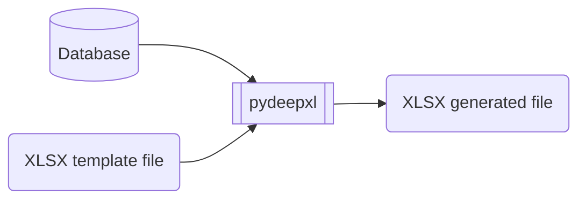

# pydeepxlsx

`pydeepxlsx` is a package used to build a XLSX file using [openpyxl](https://openpyxl.readthedocs.io/en/stable/) and a XLSX file as a template.



## Install it from PyPI

```bash
pip install project_name
```

## Usage

See [Documentation](https://github.com/wildsys/pydeepxlsx/docs/pydeepxlsx/index.html)

### Simple use case

```py
from pydeepxlsx import PyDeepXLSX

xlsx = PyDeepXLSX('./demo.xlsx')
xlsx.copy_as_it('Demo', 0)
xlsx.append_lines(
    'Demo',
    [
        {
            'item': 'Titi',
            'unit_price': 3500,
            'quantity': 0.05,
            'vat': 0.1
        },
        {
            'item': 'Toto',
            'unit_price': 1500,
            'quantity': 0.001,
            'vat': 0.2
        }
    ]
)
xlsx.wb.save('./test.xlsx')
```

## Development

Read the [CONTRIBUTING.md](CONTRIBUTING.md) file.
